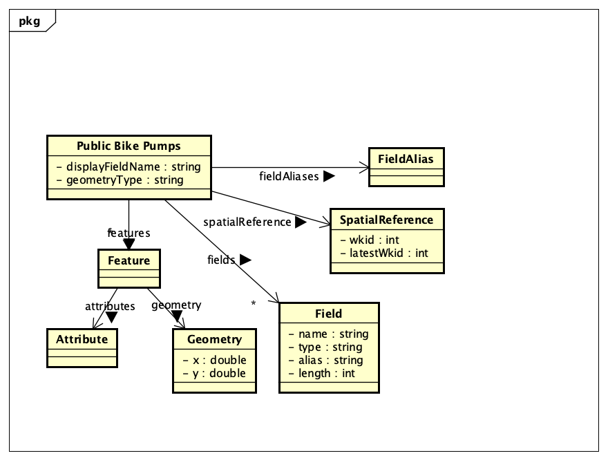

# Implementation

## Introduction
The system implemented is a web-based Pharmacy Finder application that allows users to search for nearby pharmacies using their postcode. The website provides a simple interface where users enter a postcode and the system returns pharmacies within a specified distance radius.

The system is designed to help users quickly locate pharmacies in their local area. The search feature is optimized for speed and convenience, allowing users to find pharmacies within a 2-mile radius of their entered postcode.

## Project Structure
The Pharmacy Finder website is organised into folders and files that separate different parts of the system such as the user interface, styling, and functionality. This structure makes the system easier to maintain, update, and debug.

Files:

index.html = Main home page of the website to search for pharmacies

Favourite.html = Favourite page for adding favourite pharmacies

style.css = Controls the layout, font and colour of the website

script.js = Handles search functionality and user interactions

## Software Architecture
The Pharmacy Finder system is built using a web-based architecture consisting of several major components that work together to deliver the service to users. Each component has a specific role in processing user input, retrieving pharmacy data, and displaying results.

## Bristol Open Data API
TODO: Document each query to Bristol Open Data

TODO: Repeat as necessary

# User guide
UC1 - Entering a valid postcode and filtering it by nearest

UC2 - Viweing pharmacy details via Google maps and making sure that reviews and ratings are displayed along within 2 mile radius. Doesn't notify if unavalable.

UC3 - Filtering works but becasue the postcode is in a 2 mile radius filtering wasn't needed for distance.

UC4 - Favourites work when even reloading the page and it is saved.

